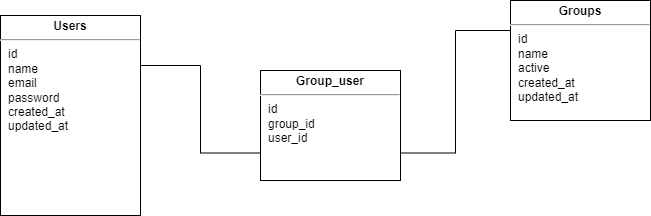

# User management system API

This API allows admin users to manage users and groups. It provides the following features:

-   Create users with a name
-   Delete users
-   Assign users to a group they aren't already part of
-   Remove users from a group
-   Create groups
-   Delete groups when they have no members

## Getting Started

### Prerequisites

To use this API, you need to have the following installed:

-   PHP >= 7.4
-   Composer
-   Laravel >= 8.x

## Installation

1. Clone the repository from GitHub

```
git clone https://github.com/fernastereo/inChallenge.git
```

2. Install dependencies

```
cd inChallenge

composer install
```

3. Copy the .env.example file and rename it to .env

```
cp .env.example .env
```

4. Update database credentials in .env file

5. Run database migrations

```
php artisan migrate
```

6. Seed the database with sample data

```
php artisan db:seed
```

7. Start the development server

```
php artisan serve
```

## API Endpoints

The API has the following endpoints:

### Users

Get all users

```
GET /api/users
```

This endpoint returns a list of all users.

Create a user

```
POST /api/users
```

This endpoint creates a new user. The request body should contain a JSON object with the following properties:

name: The user's name (required)<br>
email: The user's email (required)<br>
password: The user's password (required)

Example request body:

```
{
    "name": "John Doe"
    "email: "john@user.com"
    "password": "password"
}
```

Delete a user

```
DELETE /api/users/{id}
```

This endpoint deletes a user with the given ID.

### Groups

Get all groups

```
GET /api/groups
```

This endpoint returns a list of all groups.

Create a group

```
POST /api/groups
```

This endpoint creates a new group. The request body should contain a JSON object with the following properties::

name: The group's name (required)<br>
active: true/false.

Example request body:

```
{
    "name": "ADMIN"
    "active: true
}
```

Delete a group

```
DELETE /api/groups/{id}
```

This endpoint deletes a group with the given ID if it has no members.

Add a user to a group

```
POST /api/users/{userId}/groups/{groupId}
```

This endpoint adds a user with the given ID to a group with the given ID.

Remove a user from a group

```
DELETE /api/users/{userId}/groups/{groupId}
```

This endpoint removes a user with the given ID from a group with the given ID.

## Authentication

This API uses Sanctum for authentication. To access the endpoints that require authentication, you need to include an Authorization header with a valid API token.

You can obtain an API token by sending a POST request to the /api/login endpoint with valid credentials. The response body will contain a JSON object with the API token.

Example request body:

```
{
  "email": "user@example.com",
  "password": "password"
}
```

Example response body:

```
{
  "message": "Access granted",
  "user": {
      "id": 1,
      "name": "User's name",
      "email": "user@example.com",
      "email_verified_at": "2023-04-17T20:56:02.000000Z",
      "created_at": "2023-04-17T20:56:02.000000Z",
      "updated_at": "2023-04-17T20:56:02.000000Z"
  },
  "access_token": "1|bTvaMB90F6fiEjuEc4ha2xzNuyvL3eevsFkyiRSsZ",
  "token_type": "Bearer"
}
```

## Error Handling

The API uses HTTP status codes to indicate the success or failure of an API request. In case of an error, the API returns an error response in JSON format.

Errors that can occur while making requests to the API include the following:

-   400 Bad Request - The request could not be understood or was missing required parameters.
-   401 Unauthorized - Authentication failed or user does not have permissions for the requested operation.
-   404 Not Found - The requested resource was not found.
-   405 Method Not Allowed - The HTTP method used is not supported for the requested endpoint.
-   422 Unprocessable Entity - Validation failed for the request parameters.
-   500 Internal Server Error - An unexpected error occurred while processing the request.

The error response in JSON format includes an error message describing the error that occurred.

## Database Model



## License

The User management system API is open-sourced software licensed under the [MIT license](https://opensource.org/licenses/MIT).
